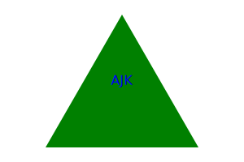

# Alex's SVG Logo Generator

## Description
Alex's SVG Logo Generator is a Node.js command-line application that allows users to create simple, customized SVG logos. The application offers customization options including text (up to three characters), text color, shape selection (circle, triangle, square), and shape color.

## Table of Contents
- [Installation](#installation)
- [Usage](#usage)
- [License](#license)
- [Contributing](#contributing)
- [Tests](#tests)
- [Screenshot](#screenshot)
- [Questions](#questions)

## Installation
To use Alex's SVG Logo Generator, you will need Node.js installed on your computer. If you do not have Node.js installed, you can download and install it from Node.js official website.  

Steps to Install
1. Download or clone the repository to your local machine.
2. Navigate to the directory where you've saved "Alex's SVG Logo Generator."
3. Run 'npm install' to install the required dependencies, including Jest.

## Usage
To generate an SVG logo, follow these steps:

1. Open a terminal or command prompt.
2. Navigate to the directory where "Alex's SVG Logo Generator" is located.
3. Run the command 'node index.js' to start the application.
4. Follow the on-screen prompts to choose your logo's text, text color, shape, and shape color.
5. The application will generate an SVG file based on your inputs and save it in the same directory.

Example:

1. Enter up to three characters for the text: ABC
2. Enter text color (keyword or hex): Blue
3. Choose a shape:
   1) circle
   2) triangle
   3) square
          Enter choice: 1
4. Enter shape color (keyword or hex): Red

## License

This project is does not have any license. 

## Contributing
For further customizations or to contribute to the project, please refer to the project's codebase and consider submitting a pull request.

## Tests
This application uses Jest for testing to ensure its components work correctly. To run these tests, follow these steps:
1. Navigate to the application's directory in a terminal or command prompt.
2. Run 'npm test' to execute the test suite through Jest.
Jest is configured to automatically find and run tests located in the project's test directories or files following naming conventions like *.test.js. The test results will be displayed in the terminal, indicating whether the tests passed or failed, along with any error messages for failures.

This process helps in identifying and fixing bugs or inconsistencies in the application's functionality, ensuring a robust and reliable tool for generating SVG logos.
## Screenshot

Here is  a link to the how-to video!
https://drive.google.com/file/d/1bB9HCh47_SHNlN8JzxO9mpq43JLuu9SR/view

## Questions
- If you have any questions, you can reach me on GitHub: <a href="https://github.com/akayer19" target="_blank">GitHub Profile</a>
- For additional questions, contact me via email: akayeauto@gmail.com
    
